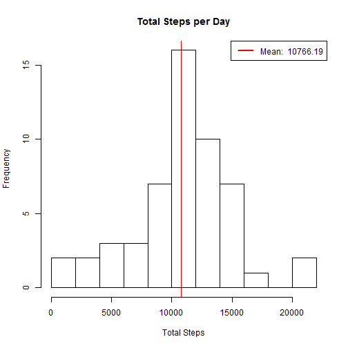
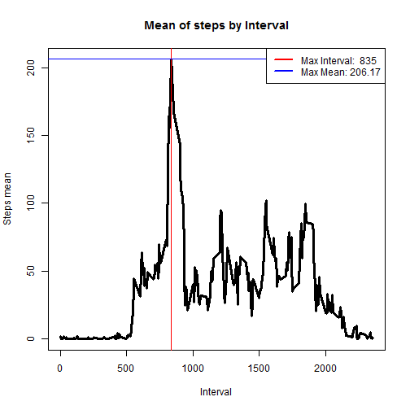
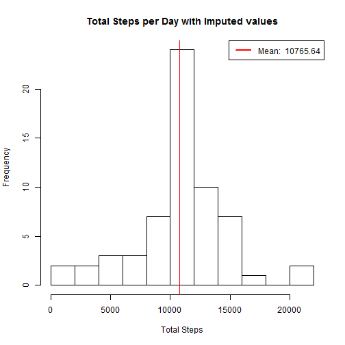
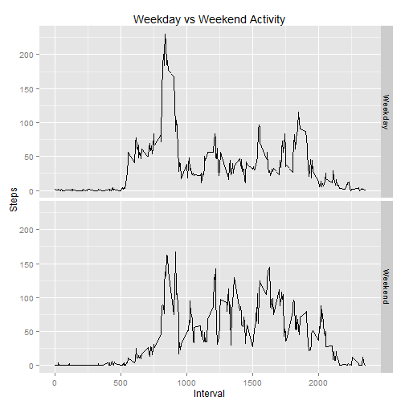

##Introduction
Analysis of activity monitoring device results.  The data was collected during the months of October and November of 2012.

## Loading and preprocessing the data


The data will be loaded into a variable for further analysis.  **To make the intent of the code clearer, data processing and transformation will be performed inside each code chunk. No preprocessing was deemed necessary.** Most of the needed transformation as simple aggregations 


```r
unzip("activity.zip")
activity <- read.csv("activity.csv")
head(activity)
```

```
##   steps       date interval
## 1    NA 2012-10-01        0
## 2    NA 2012-10-01        5
## 3    NA 2012-10-01       10
## 4    NA 2012-10-01       15
## 5    NA 2012-10-01       20
## 6    NA 2012-10-01       25
```

##Total number of steps per day

We will calculate the total steps for each day.  The function will ignore missing values and it will serve as the base for subsequent calculations.

```r
#Using the 'aggregate' function to obtain daily totals-------------------------------------------------------
steps.sum <- aggregate(steps~date, data=activity, FUN="sum")
print(paste("Total steps taken per day:", sum(steps.sum$steps)))
```

```
## [1] "Total steps taken per day: 570608"
```

The mean and median of steps per day calculation, will use the data frame created in the previous chunk.

```r
#Loading mean and median unto variables so I can use them again later----------------------------------------
steps.sum.median <-median(steps.sum$steps)
steps.sum.mean <-  round(mean(steps.sum$steps), digits=2)
print(paste("Median of total steps taken per day:", steps.sum.median)); print(paste("Mean of total steps taken per day:", steps.sum.mean))
```

```
## [1] "Median of total steps taken per day: 10765"
```

```
## [1] "Mean of total steps taken per day: 10766.19"
```

And now bringing it all together in a histogram. It displays what the distribution of these data looks like.  I also included a redline to graph the mean.  Mean and median are so close, that only one made sense to graph.


```r
#Used 'abline' to trace the red line at the total mean ------------------------------------------------------
hist(steps.sum$steps, breaks=10, main="Total Steps per Day", xlab="Total Steps"); par(new=T) 
legend("topright", c(paste("Mean: ", steps.sum.mean)), lty=c(1), lwd=c(2.5), col=c("red")); par(new=F) 
abline(v=steps.sum.mean, col="red")
```

 

##Average daily activity pattern

We will now calculate the mean of total steps by interval.  And then, we will find the row with the maximum number of steps, and then declare that row's interval as the data point we are looking for.

```r
#Loading the max mean and the interval into a variable so they can be used to the plot-----------------------
interval.sum <-aggregate(steps~interval, data=activity , FUN="mean")

max.row <- which.max(interval.sum$steps)
max.interval <- interval.sum[max.row, 1]
max.mean <- round(interval.sum[max.row,2], digits=2)

print(paste("Interval: ", max.interval)); print(paste("Number of steps:", max.mean))
```

```
## [1] "Interval:  835"
```

```
## [1] "Number of steps: 206.17"
```

Now let's look at al line plot to visually confirm the answer above.  To facilitate the such confirmation, I will also add two lines marking the interval and maximum mean of steps identified above.  *The two should intersect at the highest peak of the graph.*


```r
plot(interval.sum, type="l",lwd=3, main="Mean of steps by Interval", xlab="Interval",ylab="Steps mean") ;par(new=T) 
abline(v=max.interval, col="red"); abline(h=max.mean, col="blue")
legend("topright", c(paste("Max Interval: ", max.interval), paste("Max Mean:", max.mean)), lty=c(1,1), lwd=c(2.5,2.5), col=c("red","blue")) 
```

 


##Imputing missing values

Days with missing step data could cause bias in our date.  We will now query the data frame to find out how many observations have a NA value in the variable step.


```r
sum(as.numeric(is.na(activity$steps)))
```

```
## [1] 2304
```

The **strategy to fill out missing step data** is to choose a value that is simple to calculate, while also minimizing the impact of the change in the step variable. **Using the mean for each interval, which was calculated in a prior section (variable name: interval.sum), will allow us to assign a more customized value for each row**. This in contrast to the one constant that something like, for example, the mean of the entire data set.


```r
imp.activity <- activity
for(i in 1:nrow(imp.activity)){
  if(is.na(imp.activity[i,1])) imp.activity[i,1]=round(interval.sum[interval.sum$interval==imp.activity[i,3],][2], digits=0)
}
head(imp.activity)
```

```
##   steps       date interval
## 1     2 2012-10-01        0
## 2     0 2012-10-01        5
## 3     0 2012-10-01       10
## 4     0 2012-10-01       15
## 5     0 2012-10-01       20
## 6     2 2012-10-01       25
```

The header sample shows that the step values that were NA in the original activity variable now have actual numbers.  Calculating the the total of steps by date and its mean and median is next.

```r
imp.steps.sum <- aggregate(steps~date, data=imp.activity, FUN="sum")
imp.steps.sum.median <-median(imp.steps.sum$steps)
imp.steps.sum.mean <-  round(mean(imp.steps.sum$steps), digits=2)
print(paste("Median of total steps taken per day:", imp.steps.sum.median)); print(paste("Mean of total steps taken per day:", imp.steps.sum.mean))
```

```
## [1] "Median of total steps taken per day: 10762"
```

```
## [1] "Mean of total steps taken per day: 10765.64"
```


Let's take a look at a histogram with the same parameters as the one above, but using our new data frame. 

```r
hist(imp.steps.sum$steps, breaks=10, main="Total Steps per Day with Imputed values", xlab="Total Steps")
  abline(v=imp.steps.sum.mean, col="red")
  par(new=T) 
  legend("topright", c(paste("Mean: ", imp.steps.sum.mean)), lty=c(1), lwd=c(2.5), col=c("red")) 
```

 

**The impact imputing the missing values** can be seen on how the Frequency (y-axis) of the steps count near the mean increased more than the other values.  The mean and median remained practically unchanged, so the histogram helps to point out this unequal growth.  

##Weekdays vs Weekends

We wish to find out if activity patters are different on weekdays than on weekends.

To do this, we will add a new variable in our imputed table that will identify the two groups.


```r
#Used the first letter in the day name to identify Saturday and Sunday---------------------------------------
day.type<-NULL
is.weekend <- substr(weekdays(as.Date(imp.activity$date)),1,1)=="S"
for(i in 1:nrow(imp.activity)){
  if(is.weekend[i]){current.type<-"Weekend"}else{current.type<-"Weekday"}
  day.type <- c(day.type,current.type) }
imp.activity <- cbind(imp.activity, day.type)
head(imp.activity)
```

```
##   steps       date interval day.type
## 1     2 2012-10-01        0  Weekday
## 2     0 2012-10-01        5  Weekday
## 3     0 2012-10-01       10  Weekday
## 4     0 2012-10-01       15  Weekday
## 5     0 2012-10-01       20  Weekday
## 6     2 2012-10-01       25  Weekday
```


We will now display and contrast the pattern of Weekday versus Weekend


```r
imp.steps.mean <- aggregate(steps~day.type+interval, data=imp.activity, FUN="mean")
library(ggplot2)
data.plot <- ggplot(imp.steps.mean, aes(x=interval, y=steps))+geom_line()+facet_grid(day.type~.)
data.plot <- data.plot +labs(title="Weekday vs Weekend Activity",x="Interval",y="Steps")
print(data.plot)
```

 

The pattern differences are evident.  Overall, we can see the average remains more constant, at around 150, throughout the weekends than on the weekdays.  On weekdays, after the morning rush that peaks at 8:35am an stops at around 9am, we see the average remains under 100 for the rest of the day, except for the little peak at around quitting time.
